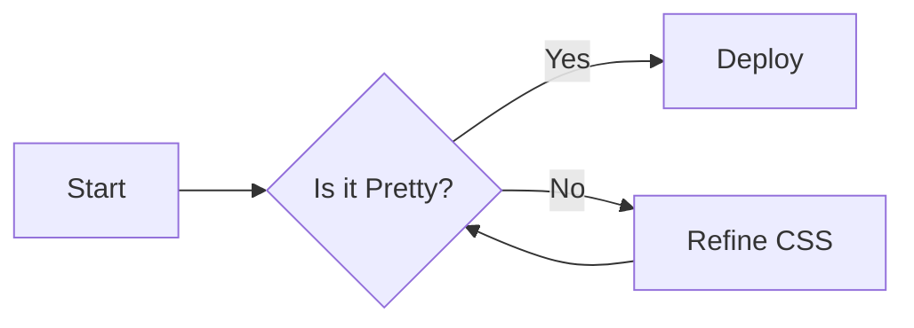

# Visual Overhaul Demo

layout: statement
A showcase of the new Premium Theme & Components.

<!-- slide_break -->

## Typography & Code

This is **Inter** font. It represents a clean, modern look.

```javascript
// This is Fira Code
function hello() {
  console.log("Stunning!");
}
```

::: callout-info
**Glassmorphism**: The callouts and blocks now use a glassmorphic effect.
:::

---

## Enhanced Tables

| Feature | Status | Priority |
| :--- | :---: | ---: |
| **Glass UI** | ✅ Ready | High |
| **Typography** | ✅ Ready | Medium |
| **Mermaid** | 🚧 WIP | Low |
| **Animations** | ⏳ Pending | Critical |

---

## Grid & Cards

::: grid-layout

::: card

### 💎 Premium

Glassmorphism is baked in.
:::

::: card

### 🚀 Fast

Powered by Alpine.js & Tailwind.
:::

::: card

### 🎨 Themed

Easy to customize CSS variables.
:::

:::

---

## Stats Component

::: columns

::: stat-box
**100%**
<span>Customizable</span>
:::

::: stat-box
**Zero**
<span>Config</span>
:::

:::

---

## Mermaid Diagrams



---

<!-- layout: code-focus -->

# Code Focus

Perfect for explaining complex logic.

The code sits on the right, utilizing the full height.

```javascript
/* This code takes center stage */
function matrix(pill) {
  if (pill === 'red') {
     return 'Truth';
  }
  return 'Ignorance';
}

const neo = new Hero();
neo.fly();
```

---

<!-- theme: neon-cyber -->
<!-- layout: statement -->

# Cyberpunk Mode

Just add `theme: neon-cyber` to a slide (or globally).

::: stat-box
**2077**
<span>Aesthetics</span>
:::

---

<!-- theme: pure-light -->
<!-- transition: slide -->

# Pure Light

Also, this slide used a `slide` transition.

Perfect for corporate use.

---

<!-- layout: timeline -->

# Project Roadmap

- **Q1 2024**
  Concept & Design Phase. Glassmorphism explored.
- **Q2 2024**
  MVP Development. CLI built.
- **Q3 2024**
  Visual Mastery. Transitions & Themes added.
- **Q4 2024**
  Global Launch.

---

# Video Embed

::: video <https://www.youtube.com/watch?v=dQw4w9WgXcQ> :::

---

# Live Poll

::: poll Do you like the new features? | Yes, No, Absolutely! :::
