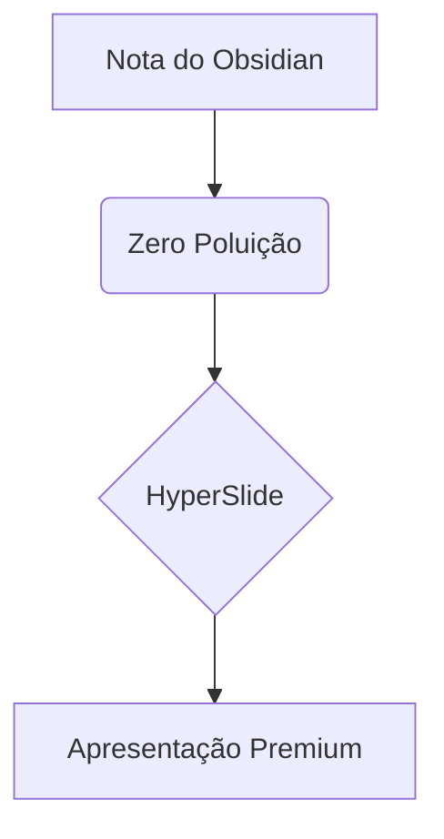

# Minha Nota do Obsidian

Esta nota não tem marcadores de slides (`---`), mas o HyperSlide vai transformá-la em uma apresentação incrível automaticamente!

## Por que isso é legal?

- **Zero Poluição**: O markdown continua limpo.
- **Auto-Layout**: O sistema entende o que é um título e o que é conteúdo.
- **Flexibilidade**: Funciona direto no seu cofre do Obsidian.

## Gráficos com Mermaid

Você pode continuar usando blocos de código normais:

## Imagens e Layouts Split

Quando o HyperSlide detecta uma imagem e um título em um slide automático, ele usa o layout `split` por padrão.

## Conclusão

O HyperSlide agora é **verdadeiramente** Zero-Config.
Viu? Sem um único `---` no meio do texto!
