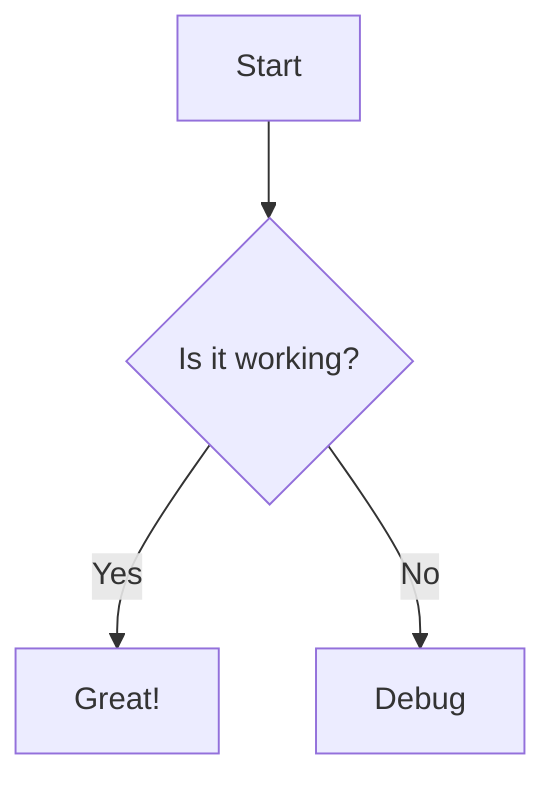

<!-- 
layout: hero
class: bg-slate-900 text-white
-->

# Components & Diagrams
HyperSlide now supports **Mermaid**, **Callouts**, and **Tables**!

---

<!-- 
layout: split
img: https://images.unsplash.com/photo-1542744173-05336fcc7ad4
-->

## Mermaid Diagrams

You can write native mermaid code blocks:

---

<!-- 
layout: default 
-->

## Obsidian Callouts

> [!INFO] Did you know?
> Use `> [!INFO] Title` to create callouts like this one.

> [!WARNING] Watch Out
> This uses simple regex parsing, but it works!

> [!SUCCESS] Success
> Changes applied successfully.

---

<!-- 
layout: default 
class: bg-slate-800
-->

## Data Tables
Standard Markdown tables are automatically styled.

| Feature | Supported | Notes |
| :--- | :---: | :--- |
| **Mermaid** | ✅ | via CDN |
| **Callouts** | ✅ | Custom CSS |
| **EJS** | ✅ | Full Styling |
| **Hot Reload** | ✅ | Instant |

---

<!-- 
layout: hero
bg: linear-gradient(to right, #4facfe 0%, #00f2fe 100%)
class: text-black
style: text-shadow: none;
-->

# It Works!
Refactored to EJS & Components Architecture.
